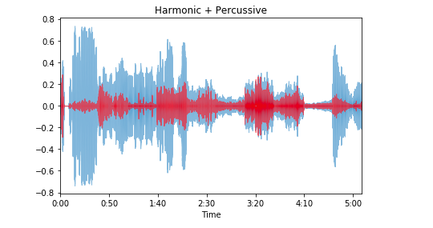

# **Planets_sound_through_Librosa**

## Intro :  
The project basically uses the Librosa python library for manipulating the audios, thus by using this library   we can classify each planets. Any object in motion will produce sound , it can be ultrasonic **(radio waves)**, infrasonic or audible and the ultrasonic sound can travel in space(vaccum). All planets are in motion 24/7, produces ultrasonic sound **(can be vibrations)** and emit it into the space. These radio waves are captured by NASA using EMFISIS instrument and convert these waves into audible waves. The waves of planets different from one another because of their chemical and geographical properties, these can be easy identified by analysing their frequency. The librosa can do this hardwork for us with couple of codes, and i will be explaining some of them in this project.

<i>visit the sound_editing.ipynb</i>

## The spectrogram of linear power frequency from specshow function:

## The spectrogram of linear power frequency of Saturn 

## The  spectrogram of log frequency from specshow function 

## The WAVE FORM shows the harmonics and percussive of each planet 

